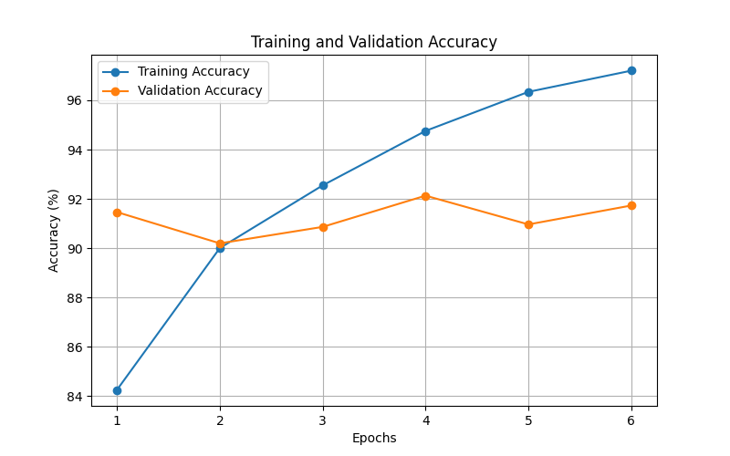
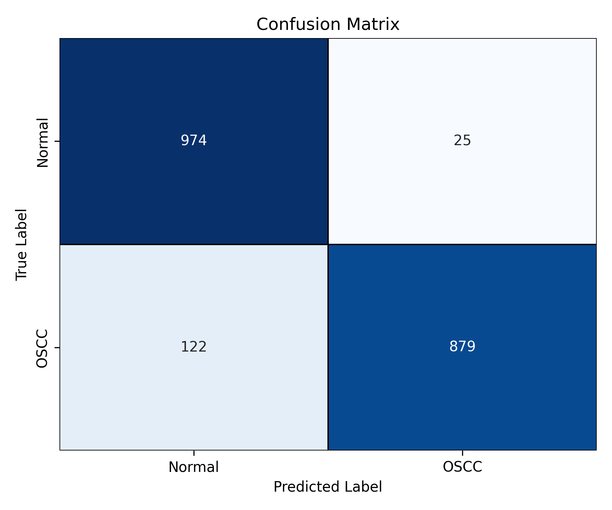
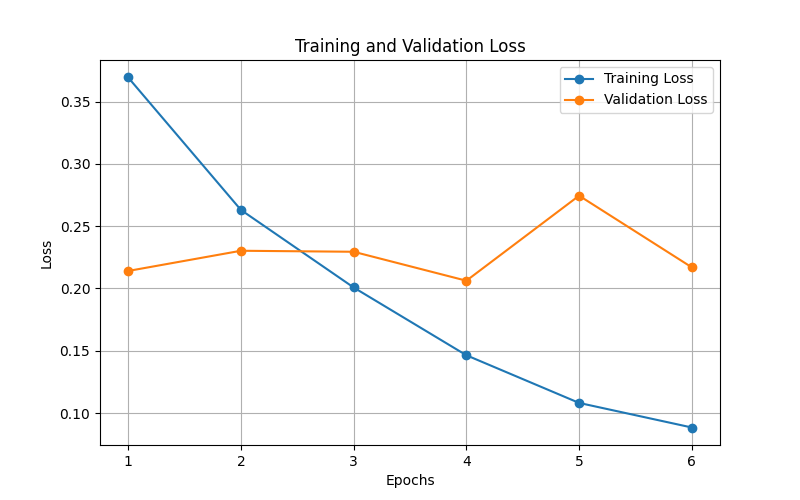

# Oral Cancer Detection using Deep Learning

## Overview

This project focuses on detecting oral cancer from histopathological images using a Convolutional Neural Network (CNN). The model classifies images into cancerous and non-cancerous categories, assisting in early diagnosis and medical image analysis.

## Key Features

* CNN-based image classification
* Binary classification: Cancer vs Non-Cancer
* Model training, validation, and evaluation pipeline
* Performance visualization using accuracy, loss curves, and confusion matrix
* Grad-CAM based visual explanations for model predictions

## Tech Stack

* Python
* TensorFlow / Keras
* NumPy, Pandas
* OpenCV
* Matplotlib, Seaborn
* Scikit-learn

## Project Structure

```
oral-cancer-detection/
│
├── src/                  # Core source code
│   ├── train_model.py
│   ├── model.py
│   ├── dataset_loader.py
│   ├── evaluate_model.py
│   ├── gradcam.py
│   └── app.py
│
├── results/              # Key output visualizations
│   ├── accuracy_graph.png
│   ├── loss_graph.png
│   └── confusion_matrix.png
│
├── tests/                # Test scripts
├── requirements.txt      # Dependencies
├── .gitignore
└── README.md
```

## Results

The model performance is evaluated using multiple metrics and visualizations:

* Accuracy and loss trends across epochs
* Confusion matrix for classification performance
* Visual interpretation using Grad-CAM





## How to Run

1. Clone the repository:

```
git clone https://github.com/aryaaa2702/oral-cancer-detection-cnn
cd oral-cancer-detection
```

2. Install dependencies:

```
pip install -r requirements.txt
```

3. Train the model:

```
python src/train_model.py
```

4. Run the application:

```
python src/app.py
```

## Note

Due to size constraints, the dataset and trained model files are not included in this repository.

## Future Improvements

* Multi-class cancer grading
* Model optimization for higher accuracy
* Deployment as a web application
* Integration with real-time medical systems
